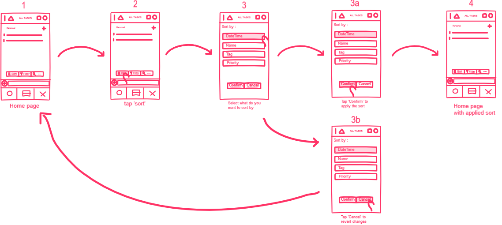

# Sketching and Prototyping
Using the information in the results of Assignment 1 for what is good and bad about the UI for designed tasks, we are going to make **Sketches** and **Prototypes**. These sketches and prototypes will lead to better design in Assignment 3. The prototypes will be then tested through a usability evaluation followed by design revision in Assignment 4.

## Part A: Sketches
Sketch at least **3 (three)** different UIs for the functions you are targeting. These three interfaces should be _dramatically different_ in terms of design directions. For example, they can be with different organizations of what functions on each screen or using a different layout of the icons, widgets, and menus on the screens. If you want, you can also incorporate non-on-screen UIs: physical buttons, gestures through motion sensors, etc.

You need **not** sketch the whole interface. It is not necessary for the sketches to have every function or every function in detail, but there should be enough to show off your general idea. **Be creative!** Draw your idea and label a few of the widgets so we can tell your intent. The goal is to have at least 3 good UIs in *interesting* ways. Sketches should be done on paper with pens and/or pencils (do not use a computer).

### 1. Scan/Photo of Sketches
```
I hope my writings and sketches are understandable
```
#### Solution 1

<p align="center">
  <br><br>
</p>

#### Solution 2
<p align="center">
  <br><br>
</p>

##### Solution 3
<p align="center">
  <br><br>
</p>

### 2. Version Differences

#### Problems
- Unreachable sort feature.
- No filter / 'show by' feature.
- No search schedule by name feature.

#### Possible Solutions

##### Solution 1
- Create a floating toolbox that consists of 3 blocks : sort, filter, and search.
- When a user touched one of the block, then a representative preferences menu will appear.

##### Solution 2
- Using the button / icon in the top-right as the main access to those features.
- Add the menu for sort, filter, and search.
- When a user touched one of the list, then a representative preferences menu will appear.

##### Solution 3
- Using the hidden sidebar menu by swipe / flick the screen from left side. (Must create hints or interaction animations for the visibility of the sidebar)
- Sidebar will appear with sliding animation.
- Put the menu for sort, filter, and search in the sidebar.
- When a user touched one of the list, then a representative preferences menu will appear.

### 3. Selected Sketch
I choose the solution 1 for the design. There is actually a sort feature in the icon provided as in solution 2, but previously on contextual inquiry, the user didn't know whether the sort feature lies in the top right icon. So it would be good if the user knows the feature is floating on the homepage.
But there are possible side effect by this solution. Some user may find this 3 blocks annoying when it's always appearing on the main page. This side effect can be solved by reducing the appearance time of the floating toolbox, such as hiding the toolbox when the user starts scrolling. 
Note that this toolbox will only appear when user is idle on home page (not appearing when the user is accessing another feature than home page).

### 4. Design Rationale
The design chosen based on the contextual inquiry on non-tech savvy users, and also from consideration of the feedbacks given by the user.

## Part B: Assumptions
### 1. Hardware
```
- Hardware Required : Smartphone
- OS : Android based (any Version)
- Storage : 128 MB (minimum)
- Screen Resolution : Any
```
### 2. Users
```
- User age range 3+ years old
- Know the basics of using smartphones.
- User must have google account, and know to use it.
- User must not always have any experience from the app.
```

## Part C: Prototypes

### Low Fidelity Prototypes

Link to inVision : https://freehand.invisionapp.com/freehand/document/SnG9E6Mcy

<p align="center">
	<br><br>
</p>

<p align="center">
	<br><br>
</p>

<p align="center">
	<br><br>
</p>

Link to inVision preview (with hotspots) : https://invis.io/5SR8BI0XAHV#/354662965_Hf1

### High Fidelity Prototypes

Link to inVision preview : https://invis.io/5SR8BI0XAHV#/356006873_Highf1
